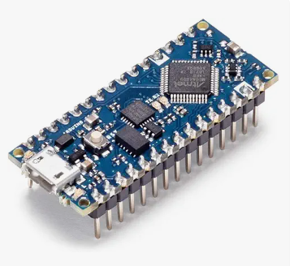

Arduino project to realise a digital clock with MP3 alarm.

Version en français : [FR](#le-projet-alarm-clock)

A short description of the components is below.

Detailled specifications of the components are there : [components](docs/components.md)

To configure the IDE : [IDE](docs/IDE_arduino.md)

The wiring of the test board : [wiring](docs/cablage.md)

The software description : [SW](docs/SW_design.md)

---
# The alarm clock project
This project is an example of simple hardware design to help electronics enthusiasts design Arduino software.  
As I am discovering C++ and Arduino's libraries, this project can be helpful for people like me and can serve as an example for all sorts of projects.
# The CPU
The module used to realize the clock is an Arduino nano.

The Arduino Nano is a compact microcontroller board based on the ATmega328.  
It features 14 digital pins and 8 analog inputs.  
Programming is done through a mini-B USB port and it supports most Arduino accessories.  
Its small size makes it perfect for embedded or breadboard projects.
# The real time clock (RTC)

The DS3231 is a highly accurate real-time clock (RTC) module using an I2C interface.  
It features a temperature-compensated oscillator, ensuring excellent timekeeping stability.  
The module includes a backup battery, retaining time even when power is off.  
# The LCD display

The 16x2 I2C LCD display shows 16 characters on 2 lines using a simplified I2C interface.  
It reduces the number of wires needed when connecting to an Arduino.  
Ideal for displaying text or data in interactive electronic projects.  
# The MP3 player

The Mini MP3 DFPlayer is a compact module that enables standalone playback of MP3 audio files from a microSD card.  
It easily interfaces with Arduino using simple serial communication.  
The module features a built-in speaker output and can be controlled via software commands. 
# The buttons

For interactivity, two buttons are mounted on the board. With them, you can adjust the current time and alarm time, set the date, activate the alarm, stop it, and more. All by navigating through menus and using the display.
# The speaker

This compact speaker (3W, 4ohms) is perfect for connecting to a Mini MP3 DFPlayer module. It works directly with the DFPlayer’s audio output.

---

---
# Le projet alarm clock

Ce projet est un exemple simple de conception d'une fonction pour aider les passionnés d'électronique à programmer une Arduino.
Comme je découvre le C++ et les librairies Arduino, ce projet peut être utile pour les personnes comme moi et peut servir d'exemple pour toutes sortes de projets.
# Le CPU

Le module utilisé pour ce projet d'horloge est une Arduino nano.

L’Arduino Nano est une carte microcontrôleur compacte basée sur l’ATmega328.  
Elle dispose de 14 broches numériques et de 8 entrées analogiques.
Elle se programme via un port USB mini-B et supporte la plupart des accessoires Arduino.  
Sa petite taille la rend parfaite pour les projets embarqués ou sur breadboard.
# L'horloge temps réel (RTC)

Le DS3231 est un module d’horloge temps réel (RTC) très précis, utilisant une interface I2C.  
Il intègre un oscillateur à compensation de température, assurant une forte stabilité temporelle.  
Le module fonctionne avec une pile de secours, conservant l’heure même hors tension. 

# L'afficheur LCD

L’afficheur LCD 16x2 I2C permet d’afficher 16 caractères sur 2 lignes via une interface I2C simplifiée.  
Il réduit le nombre de fils nécessaires à la connexion avec un module Arduino.  
Idéal pour afficher des textes ou des données dans des projets électroniques interactifs. 

# Le lecteur MP3

Le Mini MP3 DFPlayer est un module compact permettant la lecture autonome de fichiers audio MP3 depuis une carte microSD.  
Il s’interface facilement avec Arduino grâce à une communication série simple.  
Le module dispose d’une sortie haut-parleur intégrée et peut être contrôlé par des commandes logicielles. 

# Les boutons

Pour l'interactivité, deux boutons sont montés sur la carte. Avec eux, on peut ajuster les heures courantes et de l'alarme, la date, activer l'alarme, la stopper... Tout cela en passant par des menus et en utilisant l'afficheur.
# Le haut parleur

Ce haut-parleur compact (3W, 4ohms) est prévu pour être branché sur un module Mini MP3 DFPlayer. Il fonctionne directement avec la sortie du DFPlayer.

